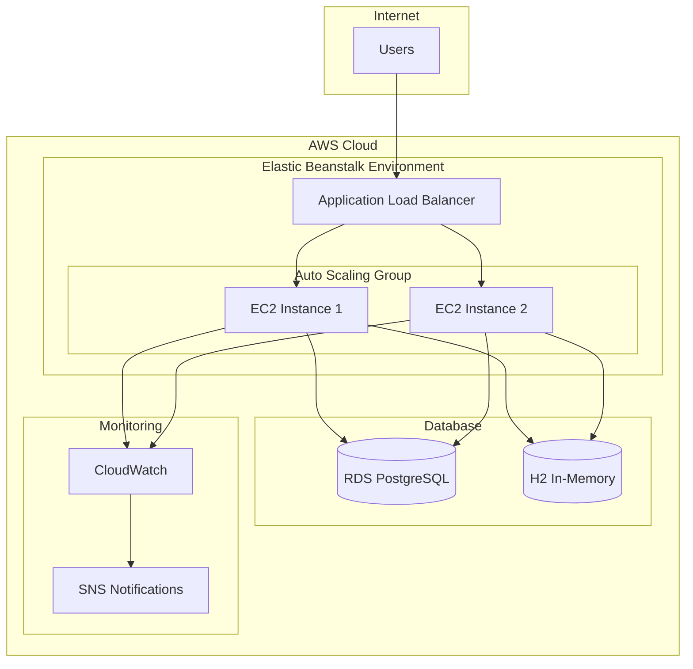

# Design Document

## Overview

The AWS deployment design provides a simplified yet robust approach to deploying the Product Inventory API to AWS. The solution uses AWS Elastic Beanstalk for application deployment, which abstracts away infrastructure complexity while providing auto-scaling, monitoring, and deployment capabilities. This approach reduces operational overhead and accelerates time-to-market while maintaining production-ready features. The design supports both development and production environments with appropriate cost optimization and security measures.

## Architecture

### High-Level Architecture



### Environment Strategy

**Development Environment:**
- Single instance (t3.micro) for cost optimization
- H2 in-memory database (existing configuration)
- Basic health monitoring
- Manual deployment process
- Cost-effective configuration

**Production Environment:**
- Multi-instance deployment with load balancing
- RDS PostgreSQL with automated backups and Multi-AZ
- Auto-scaling based on CPU and request metrics
- Enhanced monitoring and alerting
- Blue-green deployment capability

## Components and Interfaces

### 1. Elastic Beanstalk Application Platform

**AWS Elastic Beanstalk:**
- **Platform**: Java 17 with Corretto on Amazon Linux 2
- **Application Version**: JAR file deployment from Maven build
- **Environment Configuration**: Separate environments for development and production
- **Auto Scaling**: CPU-based scaling with configurable thresholds
- **Health Monitoring**: Built-in health dashboard and application health checks

**Instance Specifications:**
```yaml
Development:
  InstanceType: t3.micro
  MinInstances: 1
  MaxInstances: 1
  
Production:
  InstanceType: t3.small
  MinInstances: 2
  MaxInstances: 6
  ScalingTrigger: CPU > 70%
```

### 2. Load Balancing and Networking

**Application Load Balancer (Managed by Beanstalk):**
- **Health Check**: Spring Boot Actuator `/actuator/health` endpoint
- **SSL/TLS**: AWS Certificate Manager integration
- **Security Groups**: Automatic configuration with customizable rules
- **Sticky Sessions**: Disabled (stateless Spring Boot application)

**Network Configuration:**
- **Default VPC**: Utilizes existing VPC or creates new one
- **Public Subnets**: For load balancer and instances
- **Security Groups**: Managed by Beanstalk with custom overrides
- **Internet Gateway**: Automatic configuration for public access

### 3. Database Layer

**Development Environment:**
- **H2 In-Memory Database**: Existing configuration maintained
- **Connection**: `jdbc:h2:mem:inventorydb`
- **Configuration**: Environment variables via Beanstalk configuration
- **No External Dependencies**: Self-contained for development

**Production Environment:**
- **Amazon RDS PostgreSQL**: Managed database service
- **Instance Class**: db.t3.micro (cost-effective, upgradeable)
- **Multi-AZ Deployment**: High availability and automatic failover
- **Automated Backups**: 7-day retention with point-in-time recovery
- **Security**: VPC security groups, encryption at rest and in transit
- **Connection Management**: HikariCP with optimized pool settings

### 4. Security Configuration

**Network Security:**
- **Security Groups**: Beanstalk-managed with custom rules
  - **Web Tier**: HTTP (80) and HTTPS (443) from internet
  - **Application Tier**: Port 8080 from load balancer only
  - **Database Tier**: PostgreSQL (5432) from application instances only
- **VPC Configuration**: Default VPC with public subnets for simplicity
- **SSL/TLS**: AWS Certificate Manager for HTTPS termination

**Application Security:**
- **IAM Instance Profile**: EC2 instances with minimal required permissions
- **Environment Variables**: Sensitive data via Beanstalk configuration
- **Database Credentials**: AWS Systems Manager Parameter Store integration
- **Application Properties**: Secure configuration management

### 5. Monitoring and Logging

**CloudWatch Integration:**
- **Application Logs**: Structured JSON logging with correlation IDs
- **Metrics**: Custom metrics for business KPIs (API response times, error rates)
- **Dashboards**: Real-time monitoring of application and infrastructure metrics
- **Log Groups**: Separate groups for application and access logs

**Alerting Strategy:**
- **SNS Topics**: Critical alerts to operations team
- **CloudWatch Alarms**: 
  - High CPU utilization (>80% for 5 minutes)
  - High error rate (>5% for 2 minutes)
  - Database connection failures
  - Task failure notifications

## Data Models

### Environment Configuration

```yaml
# Development Environment
Environment: development
Platform: Java 17 with Corretto
InstanceType: t3.micro
Database:
  Type: H2
  URL: jdbc:h2:mem:inventorydb
  Driver: org.h2.Driver
Scaling:
  MinInstances: 1
  MaxInstances: 1
  TargetCPU: 70%

# Production Environment  
Environment: production
Platform: Java 17 with Corretto
InstanceType: t3.small
Database:
  Type: PostgreSQL
  Host: ${RDS_ENDPOINT}
  Port: 5432
  Name: inventory_prod
  Username: ${DB_USERNAME}
  Password: ${DB_PASSWORD}
Scaling:
  MinInstances: 2
  MaxInstances: 6
  TargetCPU: 70%
```

### Deployment Structure

```
aws-deployment/
├── .ebextensions/              # Beanstalk configuration files
│   ├── 01-environment.config   # Environment variables
│   ├── 02-database.config      # Database configuration
│   └── 03-monitoring.config    # CloudWatch configuration
├── Dockerrun.aws.json          # Optional: Docker deployment
├── application.properties       # Production Spring Boot config
└── deployment-scripts/
    ├── deploy-dev.sh           # Development deployment script
    ├── deploy-prod.sh          # Production deployment script
    └── create-rds.sh           # RDS setup script
```

## Error Handling

### Deployment Failures

**Rollback Strategy:**
- **Elastic Beanstalk**: Automatic rollback on failed deployments and health checks
- **Database Migrations**: Flyway with rollback scripts for schema changes
- **Application Versions**: Maintain previous versions for quick rollback
- **Configuration Changes**: Version-controlled environment configuration

**Failure Scenarios:**
1. **Application Start Failure**: Beanstalk automatically replaces unhealthy instances
2. **Database Connection Loss**: Connection pool retry with exponential backoff
3. **Load Balancer Health Check Failure**: Instance replacement after consecutive failures
4. **Resource Exhaustion**: Auto-scaling triggers and CloudWatch alerts

### Monitoring and Alerting

**Error Classification:**
- **Critical**: Service unavailable, database connection failures
- **Warning**: High response times, elevated error rates
- **Info**: Scaling events, deployment notifications

**Response Procedures:**
- **Automated**: Auto-scaling, task replacement, circuit breaker activation
- **Manual**: Database failover, infrastructure scaling, code rollback

## Testing Strategy

### Infrastructure Testing

**Beanstalk Configuration Testing:**
- Environment configuration validation
- Security group rule verification
- IAM role and policy testing
- Resource tagging compliance

**Integration Testing:**
- **Deployment Validation**: Automated deployment to development environment
- **Health Check Verification**: End-to-end connectivity testing via `/actuator/health`
- **Database Migration Testing**: Flyway schema update validation
- **Auto-scaling Testing**: Load testing to verify scaling behavior

### Application Testing

**JAR Deployment Testing:**
- **Maven Build**: Clean package and dependency resolution
- **Application Startup**: Spring Boot application context loading
- **Performance Testing**: Load testing with realistic traffic patterns
- **Smoke Tests**: Post-deployment API endpoint verification

**Database Testing:**
- **Migration Scripts**: Forward and rollback testing with Flyway
- **Connection Pool**: Load testing with concurrent connections
- **Backup/Restore**: RDS recovery time objective validation
- **Performance**: Query optimization and indexing validation

### CI/CD Pipeline Testing

**Pipeline Stages:**
1. **Source**: Git webhook triggers from repository
2. **Build**: Maven clean install and test execution
3. **Package**: JAR file creation and artifact storage
4. **Deploy**: Beanstalk application version deployment
5. **Test**: Automated smoke tests and health checks
6. **Notify**: Deployment status notifications via SNS

**Quality Gates:**
- Unit test coverage >80%
- Integration test success
- Application startup verification
- Health check endpoint validation