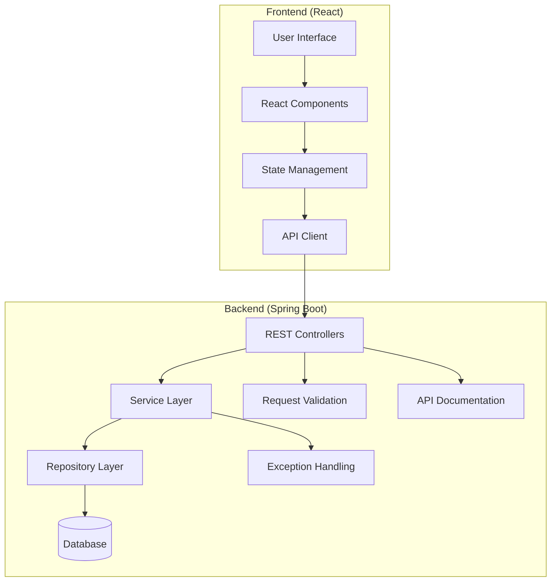
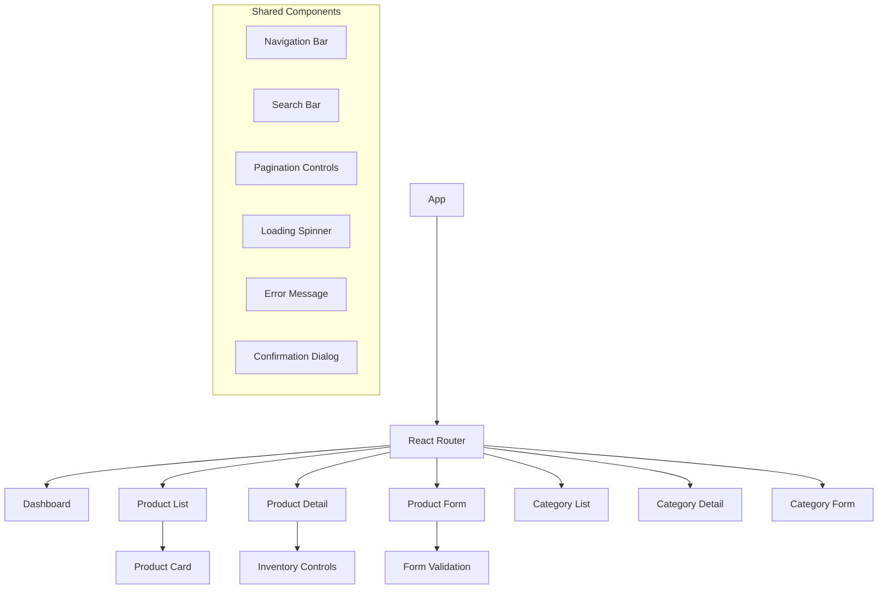
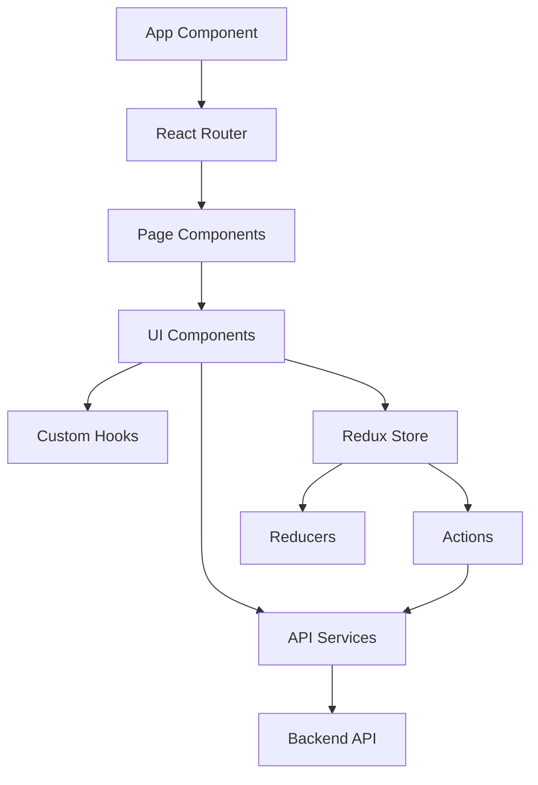

# Design Document: Product Inventory Management System

## Overview

This document outlines the technical design for a Product Inventory Management System consisting of a Spring Boot RESTful API backend and a React frontend. The backend will provide endpoints for product management, inventory tracking, category organization, and search functionality, following REST principles with standard HTTP methods and status codes. The frontend will offer an intuitive user interface for interacting with the system, built with React and modern web technologies.

## Architecture

The system follows a client-server architecture with a clear separation between the frontend and backend components:



### Backend Components:

1. **REST Controllers**: Handle HTTP requests and responses, map endpoints to services
2. **Service Layer**: Implement business logic and orchestrate operations
3. **Repository Layer**: Handle data access and persistence
4. **Exception Handling**: Global exception handling and error responses
5. **Request Validation**: Validate incoming request data
6. **API Documentation**: Swagger/OpenAPI documentation

### Frontend Components:

1. **React Components**: Reusable UI components for building the interface
2. **State Management**: Redux or Context API for managing application state
3. **API Client**: Service for communicating with the backend API
4. **Routing**: React Router for navigation between different views
5. **Form Handling**: Form validation and submission logic

## Components and Interfaces

### Controllers

#### ProductController

```java
@RestController
@RequestMapping("/api/products")
public class ProductController {
    // CRUD operations for products
    // Inventory management endpoints
    // Product search endpoints
}
```

#### CategoryController

```java
@RestController
@RequestMapping("/api/categories")
public class CategoryController {
    // CRUD operations for categories
    // Category-product relationship endpoints
}
```

### Services

#### ProductService

```java
@Service
public class ProductService {
    // Business logic for product management
    // Inventory operations
    // Search functionality
}
```

#### CategoryService

```java
@Service
public class CategoryService {
    // Business logic for category management
    // Category-product relationship management
}
```

### Repositories

#### ProductRepository

```java
@Repository
public interface ProductRepository extends JpaRepository<Product, Long> {
    // Custom query methods for product search
}
```

#### CategoryRepository

```java
@Repository
public interface CategoryRepository extends JpaRepository<Category, Long> {
    // Custom query methods for category operations
}
```

## Data Models

### Product

```java
@Entity
@Table(name = "products")
public class Product {
    @Id
    @GeneratedValue(strategy = GenerationType.IDENTITY)
    private Long id;
    
    @NotBlank
    private String name;
    
    @NotBlank
    private String description;
    
    @Positive
    private BigDecimal price;
    
    @Min(0)
    private Integer inventoryQuantity;
    
    @Column(name = "sku", unique = true)
    private String sku;
    
    @ManyToOne
    @JoinColumn(name = "category_id")
    private Category category;
    
    private boolean lowStock;
    
    // Getters, setters, constructors
}
```

### Category

```java
@Entity
@Table(name = "categories")
public class Category {
    @Id
    @GeneratedValue(strategy = GenerationType.IDENTITY)
    private Long id;
    
    @NotBlank
    @Column(unique = true)
    private String name;
    
    private String description;
    
    @OneToMany(mappedBy = "category")
    private List<Product> products;
    
    // Getters, setters, constructors
}
```

### DTOs (Data Transfer Objects)

```java
// ProductDTO for request/response
public class ProductDTO {
    private Long id;
    private String name;
    private String description;
    private BigDecimal price;
    private Integer inventoryQuantity;
    private String sku;
    private Long categoryId;
    private String categoryName;
    private boolean lowStock;
    
    // Getters, setters, constructors
}

// CategoryDTO for request/response
public class CategoryDTO {
    private Long id;
    private String name;
    private String description;
    private int productCount;
    
    // Getters, setters, constructors
}
```

## Error Handling

The API will implement a global exception handler to manage errors consistently:

```java
@RestControllerAdvice
public class GlobalExceptionHandler {
    // Handle validation errors (400 Bad Request)
    // Handle resource not found errors (404 Not Found)
    // Handle authorization errors (401/403)
    // Handle general server errors (500)
    // Handle method not allowed errors (405)
}
```

Error responses will follow a standard format:

```json
{
  "timestamp": "2025-06-23T10:15:30.123Z",
  "status": 400,
  "error": "Bad Request",
  "message": "Validation failed",
  "details": [
    "Product name cannot be empty",
    "Price must be greater than zero"
  ],
  "path": "/api/products"
}
```

## Testing Strategy

### Unit Testing

- Test individual components in isolation (services, repositories)
- Use JUnit and Mockito for mocking dependencies
- Focus on business logic and edge cases

### Integration Testing

- Test interactions between components
- Use Spring Boot Test for controller endpoints
- Test database operations with an in-memory database

### API Testing

- Test complete API endpoints with real HTTP requests
- Validate request/response formats and status codes
- Test error handling and edge cases

## Security Considerations

- Implement authentication using Spring Security (JWT or OAuth2)
- Apply role-based authorization for sensitive operations
- Validate all input data to prevent injection attacks
- Use HTTPS for all communications
- Implement rate limiting for API endpoints

## Performance Considerations

- Implement pagination for list endpoints
- Use caching for frequently accessed data
- Optimize database queries with proper indexing
- Consider using asynchronous processing for time-consuming operations

## API Documentation

- Use Springdoc OpenAPI for automatic API documentation
- Document all endpoints, request parameters, and response formats
- Include example requests and responses
- Document error codes and their meanings

## Frontend Design

### Component Structure



### Pages and Views

1. **Dashboard**
   - Display summary statistics (total products, low stock items)
   - Show recent activity or important notifications
   - Quick access to common actions

2. **Products**
   - List view with pagination, sorting, and filtering
   - Detail view for individual product information
   - Create/Edit forms for product management
   - Inventory adjustment controls (+/- buttons)

3. **Categories**
   - List view of all categories
   - Detail view showing products in a category
   - Create/Edit forms for category management

### State Management

The application will use Redux for state management with the following slices:

```javascript
// Store structure
store = {
  products: {
    items: [],
    loading: false,
    error: null,
    selectedProduct: null,
    pagination: { page: 0, size: 20, total: 0 },
    filters: { name: '', category: null, minPrice: null, maxPrice: null, inStock: false }
  },
  categories: {
    items: [],
    loading: false,
    error: null,
    selectedCategory: null
  },
  ui: {
    notifications: [],
    confirmDialog: { open: false, title: '', message: '', onConfirm: null }
  }
}
```

### API Integration

The frontend will communicate with the backend using an API client service:

```javascript
// Example API client structure
const api = {
  products: {
    getAll: (page, size) => axios.get('/api/products', { params: { page, size } }),
    getById: (id) => axios.get(`/api/products/${id}`),
    create: (product) => axios.post('/api/products', product),
    update: (id, product) => axios.put(`/api/products/${id}`, product),
    delete: (id) => axios.delete(`/api/products/${id}`),
    updateInventory: (id, quantity) => axios.put(`/api/products/${id}/inventory`, { quantity }),
    increaseInventory: (id, quantity) => axios.post(`/api/products/${id}/inventory/increase`, { quantity }),
    decreaseInventory: (id, quantity) => axios.post(`/api/products/${id}/inventory/decrease`, { quantity }),
    search: (params) => axios.get('/api/products/search', { params })
  },
  categories: {
    getAll: () => axios.get('/api/categories'),
    getById: (id) => axios.get(`/api/categories/${id}`),
    create: (category) => axios.post('/api/categories', category),
    update: (id, category) => axios.put(`/api/categories/${id}`, category),
    delete: (id) => axios.delete(`/api/categories/${id}`),
    getProducts: (id, page, size) => axios.get(`/api/categories/${id}/products`, { params: { page, size } })
  }
}
```

### Responsive Design

The UI will be designed to work across different device sizes:

- **Desktop**: Full-featured interface with multi-column layouts
- **Tablet**: Adapted layouts with optimized space usage
- **Mobile**: Single-column layouts with collapsible menus and simplified controls

The application will use responsive design principles and CSS media queries to adapt to different screen sizes. Material-UI or Ant Design will be used as the component library to ensure consistent styling and built-in responsiveness.

### Error Handling and Loading States

- Display loading spinners during API calls
- Show error messages for failed API requests
- Implement retry mechanisms for transient errors
- Provide clear validation feedback on forms
- Use toast notifications for success/error messages#
# Frontend Architecture

The frontend will be built using React with TypeScript and will follow a component-based architecture. The application will use React Router for navigation and Redux for state management.



### Key Frontend Components:

1. **App Component**: The root component that sets up routing and global providers
2. **Page Components**: Container components for different views (Dashboard, Products, Categories, etc.)
3. **UI Components**: Reusable components for common UI elements (forms, tables, cards, etc.)
4. **Custom Hooks**: Encapsulate reusable logic (API calls, form handling, etc.)
5. **API Services**: Handle communication with the backend API
6. **Redux Store**: Manage global application state
7. **Reducers**: Handle state updates based on actions
8. **Actions**: Define operations that can change the application state

## Frontend Components

### Page Components

#### Dashboard

```typescript
// Dashboard.tsx
import React, { useEffect } from 'react';
import { useDispatch, useSelector } from 'react-redux';
import { fetchDashboardData } from '../store/actions';
import { DashboardStats, ProductsTable, LowStockAlert } from '../components';

const Dashboard: React.FC = () => {
  const dispatch = useDispatch();
  const { stats, loading, error } = useSelector((state) => state.dashboard);

  useEffect(() => {
    dispatch(fetchDashboardData());
  }, [dispatch]);

  return (
    <div className="dashboard">
      {loading ? (
        <LoadingSpinner />
      ) : error ? (
        <ErrorMessage message={error} />
      ) : (
        <>
          <DashboardStats stats={stats} />
          <LowStockAlert products={stats.lowStockProducts} />
          <ProductsTable products={stats.recentProducts} />
        </>
      )}
    </div>
  );
};
```

#### Products

```typescript
// Products.tsx
import React, { useState, useEffect } from 'react';
import { useDispatch, useSelector } from 'react-redux';
import { fetchProducts, deleteProduct } from '../store/actions';
import { ProductsTable, ProductForm, Pagination, SearchBar } from '../components';

const Products: React.FC = () => {
  const dispatch = useDispatch();
  const { products, loading, error, pagination } = useSelector((state) => state.products);
  const [showForm, setShowForm] = useState(false);
  const [selectedProduct, setSelectedProduct] = useState(null);
  const [searchParams, setSearchParams] = useState({});

  useEffect(() => {
    dispatch(fetchProducts(searchParams));
  }, [dispatch, searchParams]);

  // Component logic...

  return (
    <div className="products-page">
      <SearchBar onSearch={handleSearch} />
      <button onClick={() => setShowForm(true)}>Add Product</button>
      
      {showForm && (
        <ProductForm 
          product={selectedProduct} 
          onSubmit={handleSubmit} 
          onCancel={() => setShowForm(false)} 
        />
      )}
      
      <ProductsTable 
        products={products} 
        onEdit={handleEdit} 
        onDelete={handleDelete} 
      />
      
      <Pagination 
        currentPage={pagination.currentPage} 
        totalPages={pagination.totalPages} 
        onPageChange={handlePageChange} 
      />
    </div>
  );
};
```

### UI Components

#### ProductForm

```typescript
// ProductForm.tsx
import React from 'react';
import { useForm } from 'react-hook-form';
import { TextField, Select, Button } from '../ui';

interface ProductFormProps {
  product?: Product;
  onSubmit: (data: ProductFormData) => void;
  onCancel: () => void;
}

const ProductForm: React.FC<ProductFormProps> = ({ product, onSubmit, onCancel }) => {
  const { register, handleSubmit, formState: { errors } } = useForm({
    defaultValues: product || {
      name: '',
      description: '',
      price: '',
      sku: '',
      categoryId: '',
      lowStockThreshold: 5,
    }
  });

  return (
    <form onSubmit={handleSubmit(onSubmit)}>
      <TextField
        label="Name"
        {...register('name', { required: 'Name is required' })}
        error={errors.name?.message}
      />
      
      {/* Other form fields */}
      
      <div className="form-actions">
        <Button type="button" variant="secondary" onClick={onCancel}>
          Cancel
        </Button>
        <Button type="submit" variant="primary">
          {product ? 'Update Product' : 'Create Product'}
        </Button>
      </div>
    </form>
  );
};
```

## API Services

```typescript
// api/productService.ts
import axios from 'axios';
import { API_BASE_URL } from '../config';

const API_URL = `${API_BASE_URL}/api/products`;

export const productService = {
  getAll: async (params) => {
    const response = await axios.get(API_URL, { params });
    return response.data;
  },
  
  getById: async (id) => {
    const response = await axios.get(`${API_URL}/${id}`);
    return response.data;
  },
  
  create: async (product) => {
    const response = await axios.post(API_URL, product);
    return response.data;
  },
  
  update: async (id, product) => {
    const response = await axios.put(`${API_URL}/${id}`, product);
    return response.data;
  },
  
  delete: async (id) => {
    await axios.delete(`${API_URL}/${id}`);
    return id;
  },
  
  updateInventory: async (id, quantity) => {
    const response = await axios.put(`${API_URL}/${id}/inventory`, { quantity });
    return response.data;
  },
  
  increaseInventory: async (id, quantity) => {
    const response = await axios.post(`${API_URL}/${id}/inventory/increase`, { quantity });
    return response.data;
  },
  
  decreaseInventory: async (id, quantity) => {
    const response = await axios.post(`${API_URL}/${id}/inventory/decrease`, { quantity });
    return response.data;
  },
  
  search: async (params) => {
    const response = await axios.get(`${API_URL}/search`, { params });
    return response.data;
  }
};
```

## State Management

### Redux Store Structure

```typescript
// store/index.ts
import { configureStore } from '@reduxjs/toolkit';
import productsReducer from './productsSlice';
import categoriesReducer from './categoriesSlice';
import dashboardReducer from './dashboardSlice';
import uiReducer from './uiSlice';

export const store = configureStore({
  reducer: {
    products: productsReducer,
    categories: categoriesReducer,
    dashboard: dashboardReducer,
    ui: uiReducer,
  },
});
```

### Redux Slice Example

```typescript
// store/productsSlice.ts
import { createSlice, createAsyncThunk } from '@reduxjs/toolkit';
import { productService } from '../api/productService';

export const fetchProducts = createAsyncThunk(
  'products/fetchProducts',
  async (params, { rejectWithValue }) => {
    try {
      return await productService.getAll(params);
    } catch (error) {
      return rejectWithValue(error.response?.data || 'Failed to fetch products');
    }
  }
);

// Other async thunks for CRUD operations...

const productsSlice = createSlice({
  name: 'products',
  initialState: {
    items: [],
    loading: false,
    error: null,
    pagination: {
      currentPage: 0,
      totalPages: 0,
      totalItems: 0,
    },
  },
  reducers: {
    // Synchronous reducers...
  },
  extraReducers: (builder) => {
    builder
      .addCase(fetchProducts.pending, (state) => {
        state.loading = true;
        state.error = null;
      })
      .addCase(fetchProducts.fulfilled, (state, action) => {
        state.loading = false;
        state.items = action.payload.content;
        state.pagination = {
          currentPage: action.payload.number,
          totalPages: action.payload.totalPages,
          totalItems: action.payload.totalElements,
        };
      })
      .addCase(fetchProducts.rejected, (state, action) => {
        state.loading = false;
        state.error = action.payload;
      });
    
    // Other async action handlers...
  },
});
```

## Routing

```typescript
// App.tsx
import React from 'react';
import { BrowserRouter as Router, Routes, Route } from 'react-router-dom';
import { Provider } from 'react-redux';
import { store } from './store';
import { Dashboard, Products, ProductDetail, Categories, CategoryDetail, NotFound } from './pages';
import { Layout } from './components';

const App: React.FC = () => {
  return (
    <Provider store={store}>
      <Router>
        <Layout>
          <Routes>
            <Route path="/" element={<Dashboard />} />
            <Route path="/products" element={<Products />} />
            <Route path="/products/:id" element={<ProductDetail />} />
            <Route path="/categories" element={<Categories />} />
            <Route path="/categories/:id" element={<CategoryDetail />} />
            <Route path="*" element={<NotFound />} />
          </Routes>
        </Layout>
      </Router>
    </Provider>
  );
};
```

## Styling and UI Components

The application will use Material-UI for consistent styling and responsive design. Custom themes will be applied to match the application's branding.

```typescript
// theme.ts
import { createTheme } from '@mui/material/styles';

export const theme = createTheme({
  palette: {
    primary: {
      main: '#1976d2',
    },
    secondary: {
      main: '#dc004e',
    },
    background: {
      default: '#f5f5f5',
    },
  },
  typography: {
    fontFamily: '"Roboto", "Helvetica", "Arial", sans-serif',
    h1: {
      fontSize: '2.5rem',
      fontWeight: 500,
    },
    // Other typography settings...
  },
  components: {
    // Component customizations...
  },
});
```

## Responsive Design

The application will implement responsive design using CSS Grid, Flexbox, and Material-UI's responsive utilities:

```typescript
// components/ProductCard.tsx
import React from 'react';
import { Card, CardContent, Typography, Box, Chip } from '@mui/material';
import { styled } from '@mui/material/styles';

const StyledCard = styled(Card)(({ theme }) => ({
  display: 'flex',
  flexDirection: 'column',
  height: '100%',
  [theme.breakpoints.up('sm')]: {
    flexDirection: 'row',
  },
}));

const ProductCard: React.FC<{ product: Product }> = ({ product }) => {
  return (
    <StyledCard>
      <Box sx={{ 
        width: '100%', 
        [theme.breakpoints.up('sm')]: { width: '30%' } 
      }}>
        
      </Box>
      <CardContent sx={{ flex: '1 0 auto' }}>
        <Typography variant="h5">{product.name}</Typography>
        <Typography variant="body2" color="text.secondary">
          {product.description}
        </Typography>
        <Box sx={{ display: 'flex', alignItems: 'center', mt: 2 }}>
          <Typography variant="h6">${product.price}</Typography>
          <Box sx={{ ml: 'auto' }}>
            {product.lowStock ? (
              <Chip label="Low Stock" color="warning" size="small" />
            ) : (
              <Chip label="In Stock" color="success" size="small" />
            )}
          </Box>
        </Box>
      </CardContent>
    </StyledCard>
  );
};
```

## Integration with Backend

The frontend will communicate with the backend API using Axios for HTTP requests. API services will handle the communication details, and Redux will manage the application state based on API responses.

## Error Handling

The application will implement comprehensive error handling for API requests and user interactions:

```typescript
// components/ErrorBoundary.tsx
import React, { Component, ErrorInfo, ReactNode } from 'react';

interface Props {
  children: ReactNode;
  fallback?: ReactNode;
}

interface State {
  hasError: boolean;
  error?: Error;
}

class ErrorBoundary extends Component<Props, State> {
  state: State = {
    hasError: false,
  };

  static getDerivedStateFromError(error: Error): State {
    return { hasError: true, error };
  }

  componentDidCatch(error: Error, errorInfo: ErrorInfo) {
    console.error('Error caught by ErrorBoundary:', error, errorInfo);
    // Log to error tracking service
  }

  render() {
    if (this.state.hasError) {
      return this.props.fallback || (
        <div className="error-container">
          <h2>Something went wrong</h2>
          <p>Please try again or contact support if the problem persists.</p>
          <button onClick={() => this.setState({ hasError: false })}>
            Try again
          </button>
        </div>
      );
    }

    return this.props.children;
  }
}
```

## Testing Strategy for Frontend

### Unit Testing

- Test individual React components in isolation
- Use React Testing Library and Jest
- Mock API calls and Redux state

### Integration Testing

- Test interactions between components
- Test Redux state changes and side effects
- Use React Testing Library for component integration tests

### End-to-End Testing

- Test complete user flows
- Use Cypress for end-to-end testing
- Verify that frontend and backend work together correctly

## Performance Optimization

- Implement code splitting using React.lazy and Suspense
- Use memoization for expensive calculations (React.memo, useMemo, useCallback)
- Optimize bundle size with tree shaking and dynamic imports
- Implement virtualization for long lists (react-window or react-virtualized)
- Use web workers for CPU-intensive tasks#
# Frontend Technology Stack

### Core Technologies

- **React**: JavaScript library for building user interfaces
- **TypeScript**: Typed superset of JavaScript for improved developer experience and code quality
- **React Router**: Library for routing and navigation in React applications
- **Redux Toolkit**: State management library with simplified Redux setup
- **Axios**: HTTP client for making API requests

### UI Components and Styling

- **Material-UI**: React component library implementing Google's Material Design
- **Emotion/Styled Components**: CSS-in-JS solution for component styling
- **React Hook Form**: Library for form handling and validation
- **Chart.js/Recharts**: Library for data visualization and charts

### Development Tools

- **Create React App**: Toolchain for setting up React applications
- **ESLint**: Code linting for identifying problematic patterns
- **Prettier**: Code formatting for consistent style
- **Jest/React Testing Library**: Testing framework for unit and integration tests

## Deployment Considerations

### Backend Deployment

- Deploy Spring Boot application as a standalone JAR
- Use Docker containers for consistent deployment across environments
- Configure environment-specific properties for database connections, logging, etc.
- Implement health checks and monitoring

### Frontend Deployment

- Build static assets for production deployment
- Serve static files from a CDN or web server
- Configure environment variables for API endpoints
- Implement CI/CD pipeline for automated builds and deployments

### Integration

- Ensure CORS configuration allows frontend to communicate with backend
- Set up proper security headers for API requests
- Configure rate limiting to prevent abuse
- Implement proper error handling for network issues

## Security Considerations

### Backend Security

- Implement authentication using Spring Security (JWT or OAuth2)
- Apply role-based authorization for sensitive operations
- Validate all input data to prevent injection attacks
- Use HTTPS for all communications
- Implement rate limiting for API endpoints

### Frontend Security

- Store sensitive data securely (no tokens in localStorage)
- Implement proper session management
- Sanitize user inputs to prevent XSS attacks
- Use secure HTTP headers
- Implement proper CSRF protection